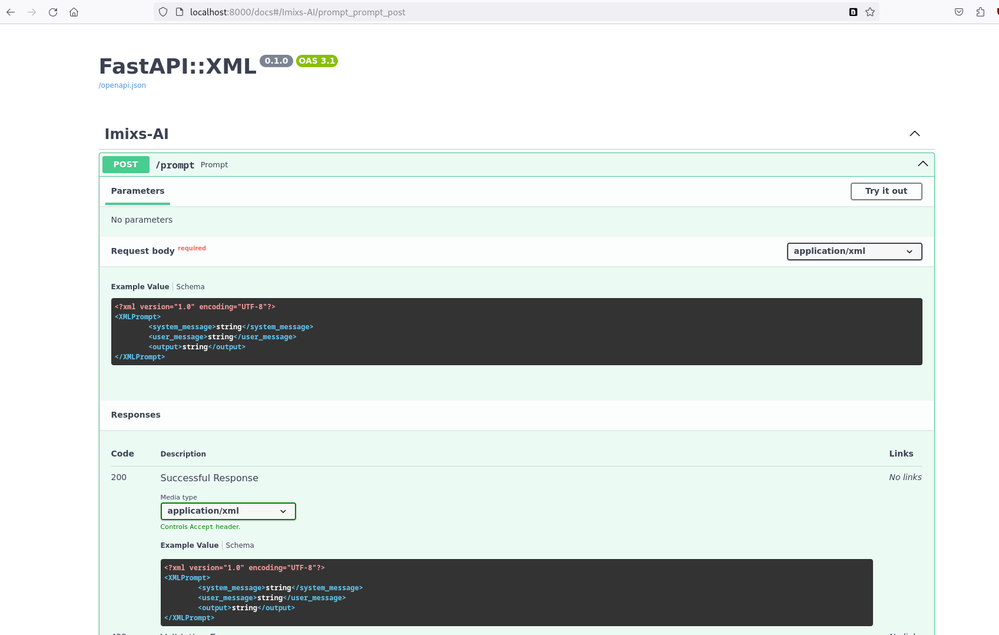

# Imixs-AI Project

Imixs-AI seamlessly integrates  Large Language Models (LLMs)  into the processing live cycle of the [Imixs-Workflow Engine](https://www.imixs.org).
The project provides adapter classes to facilitate the interaction with a generic AI-Service endpoint. Imixs-AI is model-independent and can operate on different LLMs. 
This is a powerful and flexible way to integrate modern LLMs into any kind of business processes.

The project is divided into a generic Adapter Service providing a Rest API to interact with different LLMs and a Workflow Integration module providing plug-ins and adapters to interact with a LLM.

Imixs-AI is completely model-based and integrates via the BPMN 2.0 standard. This means that no programming skills are required when interacting with an LLM.

general and model-specific modules and provides Docker images to run the modules in a container environment. 

provides a AI for business applications based on [Imixs-Workflow](https://www.imixs.org).  The project operates on Large Language Models (LLMs) and 
## Imixs-AI-LLM 

The module [imixs-ai-llm](./imixs-ai-llama-cpp/README.md) providing a model agnostic AI implementation based on [Llama.cpp](https://github.com/ggerganov/llama.cpp). Lamma CCP allows you to run a LLM with minimal setup and state-of-the-art performance on a wide variety of hardware – locally and in the cloud. 

This project is developed using the Mistral-7B Instruct model. The Mistral-7B-Instruct-v0.2 Large Language Model (LLM) is an instruct fine-tuned version of the Mistral-7B-v0.2.

    
- [Mistral-7B Instruct](https://huggingface.co/TheBloke/Mistral-7B-Instruct-v0.2-GGUF) from [Mistral AI](https://mistral.ai)

We currently tested the following Large Language models, but the project can be adapted to many other LLMs:

 - mistral-7b-instruct-v0.2.Q3_K_S.gguf
 - mistral-7b-instruct-v0.2.Q3_K_M.gguf
 - mistral-7b-instruct-v0.2.Q4_K_S.gguf 
 - mistral-7b-instruct-v0.2.Q4_K_M.gguf **(recommended)**
 - mistral-7b-instruct-v0.2.Q5_K_S.gguf
 - mistral-7b-instruct-v0.2.Q5_K_M.gguf

To find details how to download a model, read the [section imixs-ai-llm](./imixs-ai-llama-cpp/README.md). 

We are also using [FastAPI](https://fastapi.tiangolo.com/) to provide a developer friendly Open-API Rest Interface and also a XML extension based on [Fast API XML](https://github.com/cercide/fastapi-xml)

### Build and Run

To build the Imixs-AI Docker image run:

    $ cd ./imixs-ai-llm
    $ ./devi build

**Note** that you need to provide an LLM in the `.gguf` format located in the  `/models` directory to run the container. We map this directory into the docker-compose files but do not provide any LLM in this project.

To run the Docker container run:

    $ ./devi start

Now you can access the Rest API via: 

    http://127.0.0.1:8000/docs

    

### Development

For developers we provide the docker-compose file `docker-compose-dev.yml` that maps the `/app/` directory locally into the container image. This makes it easier to change code during development. 

## Imixs-AI-Workflow

The module [imixs-ai-workflow](./imixs-ai-workflow) provides Adapter classes, CDI Beans and Service EJBs to integrate Imixs-AI into the workflow processing life cycle.
