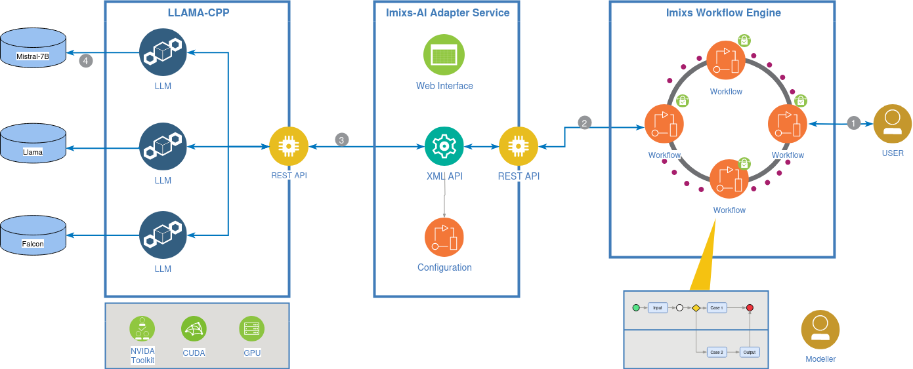

# Imixs-AI Project

**Imixs-AI** is an open source project that seamlessly integrates **Large Language Models (LLMs)** into the processing live cycle of the [Imixs-Workflow Engine](https://www.imixs.org).
The project is based on the [Open-AI API](https://github.com/openai/openai-openapi) specification and can be used to access compliant AI Servers like the [LLaMA.cpp HTTP Server](https://github.com/ggerganov/llama.cpp). Imixs-AI is model-independent and can operate on different LLMs. This is a powerful and flexible way to integrate modern LLMs into any kind of business processes.

The project provides services and adapters to facilitate the interaction of AI into a BPMN 2.0 based workflow. Imixs-AI completely integrates via the BPMN 2.0 standard into the concept of LLMs. This means that no programming skills are required when interacting with a LLM.




## Imixs-AI-Workflow

The module [imixs-ai-workflow](./imixs-ai-workflow) provides Jakarate EE services and adapter classes to access a LLM Server based on the [Open-AI API](https://github.com/openai/openai-openapi) specification. 
A prompt can be defined directly in a Imixs BPMN 2.0 model. Prompt-Templates used by the LLMAdapter Class can be defined in a BPMN Data item:


## Imixs-AI-LLaMAcpp  

The module [imixs-ai-llama-cpp](./imixs-ai-llama-cpp/README.md) provides a short introduction how to run a LLaMAc++ server with docker. 


# Prompt Engineering

If you work with prompt templates including very complex text data like business documents it is important that you make use of the `BOS Token` (Begin of String) and the `EOS token` (End Of String). These tokens indicate to the model that this context is a full completion/exchange and the completion is already finished.

Example

```
<s>[INST] You are a clerk in a logistics company and you job is to check invoices documents. [/INST]

<FILECONTEXT>^.+\.([pP][dD][fF])$</FILECONTEXT>
    
</s>
[INST] Extract the language the invoice is written in and the company name of the creditor.
Output the information in a JSON object. Create only the json object. Do not provide explanations or notes.
Example JSON Object:
{
  "invoice.language": "English",
  "cdtr.name": "Kraxi GmbH",
} [/INST]
```

Note that it is recommended to use new-lines between the beginning and and of a file context.

## BOS and EOS

Take care about the correct usage of BOS and EOS and other marker Strings like `<s>`, `</s>` or `[INST]`. 
These strings often expect an additional space character!

```
<s>[INST] This is my instruction. [/INST]
```

Note the spaces in this example!.

## Few Shot Learning

If you use the 'few shot learning' take care about your examples. Ensure that your examples match exactly the instruction and the format given in the instruction. If not this can cause bad results and at least a longer processing time!