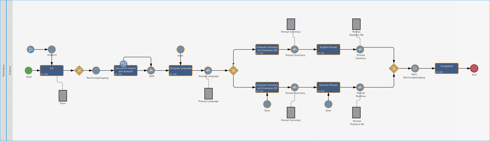

# Imixs-AI Project

Imixs-AI seamlessly integrates  Large Language Models (LLMs)  into the processing live cycle of the [Imixs-Workflow Engine](https://www.imixs.org).
The project provides adapter classes to facilitate the interaction with a generic AI-Service endpoint. Imixs-AI is model-independent and can operate on different LLMs. 
This is a powerful and flexible way to integrate modern LLMs into any kind of business processes.

The project is divided into a generic Adapter Service providing a Rest API to interact with different LLMs and a Workflow Integration module providing plug-ins and adapters to interact with a LLM.

Imixs-AI is completely model-based and integrates via the BPMN 2.0 standard. This means that no programming skills are required when interacting with an LLM.

## Imixs-AI-LLM 

The module [imixs-ai-llm](./imixs-ai-llama-cpp/README.md) provides a  model agnostic AI implementation to run LLMs on Docker. The project is based on the [LLaMA-cpp project](https://github.com/ggerganov/llama.cpp). The project provides a Rest API endpoint for text completion with a llama prompt.

## Imixs-AI-Workflow

The module [imixs-ai-workflow](./imixs-ai-workflow) provides Adapter classes, CDI Beans and Service EJBs to integrate Imixs-AI into the workflow processing life cycle. The prompt definition can be defined directly in a Imixs BPMN 2.0 model. Prompt-Templates used by the LLMAdapter Class can be defined in a BPMN Data item:

