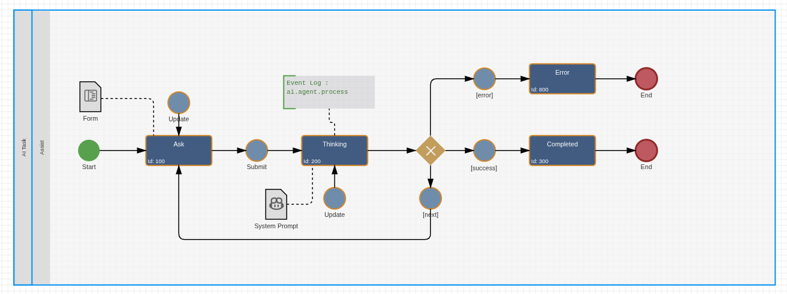

# Imixs AI AGENT

The Imixs AI AGENT module provides a generic framework for building agentic business applications.

Unlike most AI frameworks that execute agents entirely in memory, Imixs AI AGENT models every agent as a persistent BPMN workflow. Each reasoning step is executed asynchronously, the complete conversation state is persisted after every iteration, and tool execution is integrated through CDI events. This enables long-running, transactional, and recoverable AI processes that integrate seamlessly with enterprise workflows.

An Imixs AI agent executes in an autonomous reasoning loop by calling an LLM, evaluating the response, executing requested tools, and repeating this cycle until it either produces a response for the user or completes a workflow action.
Depending on the use case, an agent can either interact with a user in a conversational mode or operate autonomously as part of a larger business process.

**A dialog agent typically performs the following tasks:**

- Understand what the user wants — across languages and phrasings
- Select the right workflow process, action or event from those available to the current user
- Collect all required form field values from the conversation
- Create a new workflow instance, fill in the data, and submit it — in one turn
- Ask the user for any missing required fields and save a draft in the meantime
- Hand the user directly over to the completed workitem
- Complete a task

**In the autonomous mode an agent is able:**

- To start an agent loop based on a given processing context provided by a compliance workflow
- Select data from existing process instances
- Create new workflow instances with collected data
- Ask the user for any missing required information
- Complete a task

The implementation is open and generic and mainly based on interfaces and CDI events.

---

## Architecture Overview: The AI-Agent-Model

An **Imixs AI Agent** is itself described and embedded in a BPMN model — the **AI-Agent-Model**. This architecture makes AI agents scalable, transactional, and suitable for production environments.

When users want to interact with the agent, they start a dedicated AI agent workflow, just like any other workflow in the system. Based on the AI agent model, the process is secure, documented, and every step is fully traceable.

The AI-Agent-Model consists typically of the following tasks:

| Task      | Description                                                                                            |
| --------- | ------------------------------------------------------------------------------------------------------ |
| Ask       | User enters a natural-language prompt and optionally attaches files                                    |
| Thinking  | Agent is running asynchronously; the task can be associated with a System Prompt instructing the agent |
| Completed | Agent completed; user is redirected to the started workflow or sees the agent response                 |
| Error     | Agent loop stopped because of an internal error                                                        |



This approach makes the agent very flexible and easy to adapt on individual enterprise needs:

- Every agent run is a **persisted workflow instance** — nothing is lost on server restart or session timeout
- Multiple users can run agents **in parallel** without any shared state
- The standard Imixs **security model** applies — the agent only ever acts within the permissions of the current user
- **Retry and error handling** are built in via standard BPMN gateways, events and sequence flows.

---

## Asynchronous Processing

**BPMN AI Agents** run in an asynchronous way using the **Imixs EventLog Service**, which implements the **Change Data Capture (CDC)** pattern. Instead of running the agent synchronously inside one single transaction, the BPMN Agent holds the user task in a persistent transactional instance over the complete life cycle.
The user can monitor the agent status as for any other business process. As a result, users experience no blocking latency during workflow processing, even though individual LLM calls may take seconds or minutes.

---

### AI Agent Processing Configuration

AI Agents are defined and started in EventLog entries processed by the standard plugin `org.imixs.workflow.engine.plugins.EventLogPlugin`. This event log definition allows the configuration of an AI Agent via the BPMN model in any BPMN event. The configuration is defined in the `<document>` element of teh event log entry and is read by the `AIAgentOperator`, which picks up the EventLog entry and runs the agent loop in its own isolated transaction.

```xml
<eventlog name="ai.agent.process">
    <ref><itemvalue>$uniqueid</itemvalue></ref>
    <document>
        <agent.context.item>bpmn.agent.context</agent.context.item>
        <agent.user.item>bpmn.agent.user.input</agent.user.item>
        <agent.endpoint>my-llm</agent.endpoint>
        <agent.timeout>120000</agent.timeout>
        <agent.max-iterations>10</agent.max-iterations>
        <agent.event.success>200</agent.event.success>
        <agent.event.next>100</agent.event.next>
        <agent.event.error>280</agent.event.error>
        <agent.result.type>XML</agent.result.type>
        <agent.debug>true</agent.debug>
    </document>
</eventlog>
```

| Parameter              | Description                                                                                                                                                                  |
| ---------------------- | ---------------------------------------------------------------------------------------------------------------------------------------------------------------------------- |
| `agent.context.item`   | Item name in the workitem that holds the agent context. This indirection allows different AI-Tasks to use different context data without code changes.                       |
| `agent.user.item`      | Item name in the workitem that holds the user's natural-language prompt. This indirection allows different AI-Task forms to use different input fields without code changes. |
| `agent.endpoint`       | Logical LLM endpoint ID as registered in `imixs-llm.xml` — never a URL                                                                                                       |
| `agent.timeout`        | Maximum wall-clock time in milliseconds before the agent is aborted                                                                                                          |
| `agent.max-iterations` | Maximum number of LLM calls in one agent run to prevent runaway loops                                                                                                        |
| `agent.event.success`  | BPMN event ID to trigger when the agent completes successfully via the `task_complete` tool call                                                                             |
| `agent.event.next`     | BPMN event ID to trigger when the agent is waiting for more user input — routes the workitem back to Task "Ask" so the conversation can continue in the next turn            |
| `agent.event.error`    | BPMN event ID to trigger when the agent fails or times out                                                                                                                   |
| `agent.result.type`    | An optional result type to process a completion result by a Imixs AI Result handler out                                                                                      |
| `agent.debug`          | 'true' to activate the debug mode                                                                                                                                            |

The item referenced by `agent.context.item` contains the complete conversation state of the AI agent. It is represented as a sequence of `system`, `user`, and `assistant` messages following the OpenAI API format and includes the complete history of all tool calls. The context is persisted after each process step, allowing the agent process to be interrupted and resumed at any time without losing conversational state.

## The AIAgentPlugin

The plugin class `org.imixs.ai.agent.AIAgentPlugin` is one way to trigger an agentic business process. The plugin can be used in any compliance workflow event to start a new AI Agent process.

```xml
<imixs-ai name="AGENT">
  <debug>true</debug>
  <agent.model>ai-agent-model-de-1.0</agent.model>
  <agent.init.task>100</agent.init.task>
  <agent.init.event>100</agent.init.event>
</imixs-ai>
```

| Parameter          | Description                                               |
| ------------------ | --------------------------------------------------------- |
| `agent.model`      | The model version to run a new Imixs AI Agent             |
| `agent.init.task`  | The initial task to start a new agentic process instance  |
| `agent.init.event` | The initial event ot start a new agentic process instance |

The init event in an agentic model typically start the agent loop by defining a AI Agent Configuration as described before.
The plugin automatically connects the compliance worklfow with the AI Agent workflow and provides a reference in the item `agent.workitem.ref`.

---

## Tool Call Processing

Tool definitions are not hardcoded in the `AIAgentOperator`. Before every LLM call, the operator fires an `ImixsAIToolRegistrationEvent`. Each tool handler observes this event and registers its own function definition — this happens on every loop iteration, since function definitions are not persisted in the agent context. New tools are added by deploying a new CDI observer class, without touching the agent loop itself.

An LLM response can contain **multiple tool calls in a single completion**. `OpenAIAPIService.processToolCallResult(...)` iterates over all of them and fires an `ImixsAIToolCallEvent` for each one, in order. Every tool call in the array is fully processed — each one receives its own `role: "tool"` result message added to the conversation context — regardless of whether an earlier tool call in the same response already signalled completion via `task_complete`. Whether the agent loop actually exits after that response depends only on whether `task_complete` was among the tool calls, not on where it appears in the array. This matters for OpenAI-compatible APIs: every `tool_call_id` the LLM produced must have a matching tool result in the next request, or the following completion request is rejected.

A tool handler communicates back through three separate channels on the `ImixsAIToolCallEvent`:

- **`event.setToolMessage(...)`** — the tool result message sent back to the LLM. This is the primary steering channel for the next reasoning step; a descriptive message actively guides what the LLM does next, while a minimal one gives it nothing to work with.
- **`event.setResultValue(...)`** — an optional business result, independent of the tool message. If a handler sets this, and `agent.result.type` is configured on the agent, `OpenAIAPIService` fires an `ImixsAIResultEvent` with that value and type directly at the point the tool call is processed — for example so a registered `XML` result handler can parse structured data into the workitem. This dispatch happens per tool call, inside `processToolCallResult(...)`, not once per LLM response in the `AIAgentOperator` — a single completion can therefore trigger a distinct `ImixsAIResultEvent` for each tool call that sets a result value.
- **`event.setError(...)`** — aborts the current tool call with a descriptive error. A meaningful error message lets the LLM formulate a sensible response to the user instead of a generic failure notice.

The `task_complete` tool call is the only mechanism that ends the agent loop successfully. A plain-text response without any tool call is treated as an intermediate answer awaiting further user input, not as completion — see `agent.event.next` above.
