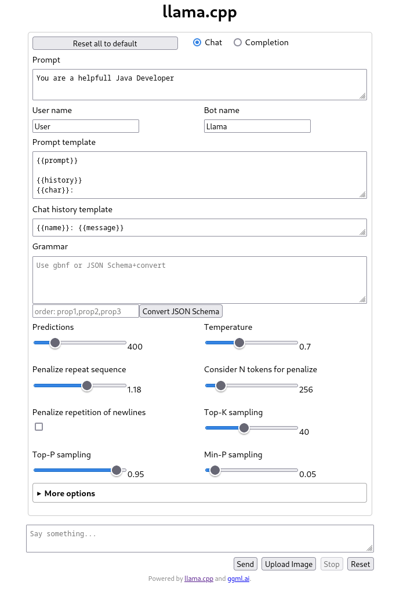

# Imixs-AI LLaMa.cpp

The module *imixs-ai-llama-cpp* provides docker examples to run [Llama.cpp](https://github.com/ggerganov/llama.cpp) for development or in a production environment. Llama CCP allows you to run a LLM with minimal setup and state-of-the-art performance on a wide variety of hardware – locally and in the cloud. 

The project provides different Docker image with an Open-API Rest Interface:

 - imixs/imixs-ai-llama-cpp-cpu Imixs-AI llama-cpp for CPU only
 - imixs/imixs-ai-llama-cpp-gpu Imixs-AI llama-cpp with GPU/CUDA support


# Quick Start with Docker and the llama.cpp Web Server

The [LLaMA-cpp project](https://github.com/ggerganov/llama.cpp) provides Docker images that can be used for a quick test without installing software libraries. You only need to make sure you have downloaded a llama model file in `.gguf` format. The following example shows how to run the llama.cpp web server locally on a CPU only with the `mistral-7b-instruct-v0.2.Q5_K_M.gguf` model: 

```bash
docker compose up
```

You can also run the container with GPU support with CUDA:

```bash
docker compose -f docker-compose-gpu.yaml up

```

Note that you need to download first a model before you start your server. 

You can access a Chat Interface via http://YOUR-SERER:8080/




## Supported LLMs

This project is developed using the Mistral-7B Instruct model. But you can run the project with any other LLM supported by Llama.cpp. The Mistral-7B-Instruct-v0.2 Large Language Model (LLM) is an instruct fine-tuned version of the Mistral-7B-v0.2.

- [Mistral-7B Instruct 0.2](https://huggingface.co/TheBloke/Mistral-7B-Instruct-v0.2-GGUF) from [Mistral AI](https://mistral.ai)
- [Mistral-7B Instruct 0.3](https://huggingface.co/MaziyarPanahi/Mistral-7B-Instruct-v0.3-GGUF) from [Mistral AI](https://mistral.ai)

We currently tested the following Large Language models, but the project can be adapted to many other LLMs:

 - mistral-7b-instruct-v0.2.Q3_K_S.gguf
 - mistral-7b-instruct-v0.2.Q3_K_M.gguf
 - mistral-7b-instruct-v0.2.Q4_K_S.gguf 
 - mistral-7b-instruct-v0.2.Q4_K_M.gguf **(recommended)**
 - mistral-7b-instruct-v0.2.Q5_K_S.gguf
 - mistral-7b-instruct-v0.2.Q5_K_M.gguf
 - Mistral-7B-Instruct-v0.3.Q8_0.gguf


### Download Mistral 7B Model

Before you can run the project and examples you need to downloaded a llama model locally on your server. The project expect that all models are located unter `imixs-ai/imixs-ai-llama-cpp/models`.  You can download a model form [huggingface.co](https://huggingface.co/) by using  the tool `huggingface-cli`. 
ex
To install the `huggingface-cli` tool run:

```
$ sudo apt install python3-pip python3.11-venv -y
$ pip install --upgrade huggingface_hub
```

Now you can download models like the Mistral 7B Model from [huggingface.co](https://huggingface.co/TheBloke/Mistral-7B-Instruct-v0.2-GGUF) - **Note** that there a different quality versions of the model available. In the following example we are downloading 2 model versions: 

```
$ cd models/
$ huggingface-cli download TheBloke/Mistral-7B-Instruct-v0.2-GGUF mistral-7b-instruct-v0.2.Q4_K_S.gguf --local-dir . --local-dir-use-symlinks False
$ huggingface-cli download TheBloke/Mistral-7B-Instruct-v0.2-GGUF mistral-7b-instruct-v0.2.Q4_K_M.gguf --local-dir . --local-dir-use-symlinks False
$ huggingface-cli download QuantFactory/Meta-Llama-3-8B-Instruct-GGUF Meta-Llama-3-8B-Instruct.Q4_K_M.gguf --local-dir . --local-dir-use-symlinks False
```

**Note:** For this project we assume that all models are located unter `imixs-ai/imixs-ai-llm/models`


## Testing with CURL

Using [curl](https://curl.se/) allows you to test a model quickly: 

```sh
curl --request POST \
    --url http://localhost:8080/completion \
    --header "Content-Type: application/json" \
    --data '{"prompt": "Building a website can be done in 10 simple steps:","n_predict": 128}'
```


# GPU Support

To run llama-cpp with GPU on Linux Debian make sure you installed the NVIDIA driver package. Details about the installation process on debian can be found in [this blog post](https://www.linuxcapable.com/install-nvidia-drivers-on-debian/). Also see the [official install guide ](https://wiki.debian.org/NvidiaGraphicsDrivers#Debian_12_.22Bookworm.22)


## Install NVIDIA Driver on Linux (Debian Bookworm)

In the following I install the proprietary NVIDIA Drivers with Cuda Support on Debian Bookworm. There are also open source drivers available, but I did not test this. 


### 1) Update your APT repositories

```
$ sudo apt update
$ sudo apt upgrade
# Remove previous installed nvida drivers (optional)
$ sudo apt autoremove nvidia* --purge
# Enable Contrib and Non-Free Repositories on Debian
$ sudo apt install software-properties-common -y
$ sudo add-apt-repository contrib non-free-firmware
```

### 2) Import the Nvidia APT Repository

This repo allows access to additional Nvidia tools like nvida-smi

```
$ sudo apt install dirmngr ca-certificates software-properties-common apt-transport-https dkms curl -y
$ sudo curl -fSsL https://developer.download.nvidia.com/compute/cuda/repos/debian12/x86_64/3bf863cc.pub | sudo gpg --dearmor | sudo tee /usr/share/keyrings/nvidia-drivers.gpg > /dev/null 2>&1
$ echo 'deb [signed-by=/usr/share/keyrings/nvidia-drivers.gpg] https://developer.download.nvidia.com/compute/cuda/repos/debian12/x86_64/ /' | sudo tee /etc/apt/sources.list.d/nvidia-drivers.list
$ sudo apt update
```


### 3) Install Nvidia Drivers on Debian via DEFAULT APT Repository

We assume you have a 64-bit system

    $ sudo apt update
    $ sudo apt install linux-headers-amd64 nvidia-detect

Check Nvidia support

```
$ nvidia-detect
Detected NVIDIA GPUs:
01:00.0 VGA compatible controller [0300]: NVIDIA Corporation GP104 [GeForce GTX 1080] [10de:1b80] (rev a1)

Checking card:  NVIDIA Corporation GP104 [GeForce GTX 1080] (rev a1)
Your card is supported by all driver versions.
Your card is also supported by the Tesla drivers series.
Your card is also supported by the Tesla 470 drivers series.
It is recommended to install the
    nvidia-driver
package.
```


The output reveals that the machine features a GeForce GTX 1080 card and recommends installing the nvidia-driver package.
Now you can finally install the recommended package....

    $ apt install nvidia-driver nvidia-smi linux-image-amd64 cuda

I install in addition the Nvida Service-Management-Interface and the CUDA framework. 

Finally reboot your system....

    $ sudo reboot

**Note:** it may happen that you need a hard reset on your machine. I don't know exactly why but it could be something with driver conflicts. 

### 4) Verify Installation

To verify your installation run `nvidia-smi` which shows you some insights of your environment:

```
# nvidia-smi
Sun Mar 31 10:46:20 2024       
+-----------------------------------------------------------------------------------------+
| NVIDIA-SMI 550.54.15              Driver Version: 550.54.15      CUDA Version: N/A      |
|-----------------------------------------+------------------------+----------------------+
| GPU  Name                 Persistence-M | Bus-Id          Disp.A | Volatile Uncorr. ECC |
| Fan  Temp   Perf          Pwr:Usage/Cap |           Memory-Usage | GPU-Util  Compute M. |
|                                         |                        |               MIG M. |
|=========================================+========================+======================|
|   0  NVIDIA GeForce GTX 1080        Off |   00000000:01:00.0 Off |                  N/A |
| 36%   42C    P0             39W /  180W |       0MiB /   8192MiB |      0%      Default |
|                                         |                        |                  N/A |
+-----------------------------------------+------------------------+----------------------+
                                                                                         
+-----------------------------------------------------------------------------------------+
| Processes:                                                                              |
|  GPU   GI   CI        PID   Type   Process name                              GPU Memory |
|        ID   ID                                                               Usage      |
|=========================================================================================|
|  No running processes found                                                             |
+-----------------------------------------------------------------------------------------+
```


## Configuring Docker with GPU Support

To get things done in addition it is necessary to install the   'NVIDIA Container Toolkit'. 
   
```
curl -fsSL https://nvidia.github.io/libnvidia-container/gpgkey |sudo gpg --dearmor -o /usr/share/keyrings/nvidia-container-toolkit-keyring.gpg \
&& curl -s -L https://nvidia.github.io/libnvidia-container/stable/deb/nvidia-container-toolkit.list | sed 's#deb https://#deb [signed-by=/usr/share/keyrings/nvidia-container-toolkit-keyring.gpg] https://#g' | sudo tee /etc/apt/sources.list.d/nvidia-container-toolkit.list \
&& sudo apt-get update
$ sudo apt-get install -y nvidia-container-toolkit    
$ sudo nvidia-ctk runtime configure --runtime=docker
sudo systemctl restart docker
```

Test Setup with

    $ nvidia-container-cli -k -d /dev/tty info


should not show errors.

Start a test container: 

    $ docker run --gpus all nvidia/cuda:12.3.1-base-ubuntu20.04  nvidia-smi

This should just the nvidia-smi output form above.


## Kubernetes

To add GPU support for kuberentes use the [NVIDIA GPU Operator](https://docs.nvidia.com/datacenter/cloud-native/gpu-operator/latest/getting-started.html).

### Install Helm

To install you need the cli tool Helm. If not yet installed run:

```
curl -fsSL -o get_helm.sh https://raw.githubusercontent.com/helm/helm/master/scripts/get-helm-3 \
    && chmod 700 get_helm.sh \
    && ./get_helm.sh
```

Next add the NVIDA Helm repository

```
helm repo add nvidia https://helm.ngc.nvidia.com/nvidia \
    && helm repo update
```


### Label Worker Nodes 

This operator adds GPU support to all worker nodes. To exclude a worker node this node have to be labeled with `feature.node.kubernetes.io/pci-10de.present=false`. You can check the current labels of your nodes with:

    $ kubectl get nodes --show-labels=true

To add the exclusion label for a specify node run:

    $ kubectl label nodes $NODE nvidia.com/gpu.deploy.operands=false

Where `$NODE` is the name of the worker node to be labeled. 

### Install The GPU Operator

There are different szenarios how to install the [NVIDIA GPU Operator](https://docs.nvidia.com/datacenter/cloud-native/gpu-operator/latest/getting-started.html). In this scenario we assume that the NVIDA Driver and Cuda Driver are already installed on the machine. 


    helm install --wait --generate-name \
        -n gpu-operator --create-namespace \
        nvidia/gpu-operator 
        
If you have the NVIDA Driver already installed on your worker node you can run without installing driver by the operator:

```
helm install --wait --generate-name \
     -n gpu-operator --create-namespace \
     nvidia/gpu-operator \
     --set driver.enabled=false
```

If something goes wrong you can delete the operator with:

    $ helm delete -n gpu-operator $(helm list -n gpu-operator | grep gpu-operator | awk '{print $1}')


### Deployment 

For the deployment in a Kubernetes cluster you can use the file `kubernetes.yaml` as a template. The template expects a data volume named `llama-cpp-models` that holds the models. 


# Prompt Engineering 

General information about prompt engineering can be found here:

 - https://www.promptingguide.ai/models/mistral-7b
 - https://community.aws/content/2dFNOnLVQRhyrOrMsloofnW0ckZ/how-to-prompt-mistral-ai-models-and-why
 - https://blog.cloudflare.com/workers-ai-update-hello-mistral-7b-de-de
 - https://www.promptingguide.ai/models/mixtral
 - https://docs.mistral.ai/guides/prompting-capabilities/


# Set Options for Llama-CPP Web Server


## Avoid infinite loop

You can can set the `predict` option to cap the number of tokens any completion request can generate
Otherwise infinite loop scenario can occur if the model hallucinates and does not stop answering.

```
-n,    --predict N              number of tokens to predict (default: -1, -1 = infinity, -2 = until context filled)
```

This server param set the number of tokens in general. 


Optional you can set `n_predict` as an option in the request body. 

```xml
<PromptDefinition>
	<prompt_options>{"max_tokens": 4096, "temperature": 0, "n_predict": 512}</prompt_options>
    ...
<PromptDefinition>
```

