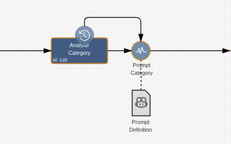
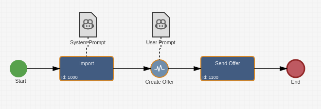

# Imixs-AI-Workflow

The Imixs-AI-Workflow module provides Adapter classes, CDI Beans and Service EJBs to integrate the Imixs-AI framework into the workflow processing life cycle.

- **OpenAIAPIService** <br/>The Imixs-AI backend service EJB interacting with a LLM service endpoint based on [Open AI API](https://github.com/openai/openai-openapi) <br/>

- **Prompt-Definition** <br/>A XML data structure holding the prompt and information of LLM service including the endpoint and LLM options<br/>

- **ImixsAIAPAdapter**<br/>A generic Workflow Adapter class used within the processing life cycle on a workflow instance to execute a LLM prompt definition. The adapter builds the prompt based on a given Prompt Template and evaluates the result object. <br/>

- **ImixsAIContextHandler** <br/> A CDI bean to setup a LLM chat conversation.

- **ImixsAISuggestController** <br/> A CDI bean for user interaction like data input, data verification and data confirmation. <br/>

- **ConditionalAIAdapter** <br/> A CDI bean evaluating conditions against an LLM <br/>

The Imixs-AI project provides flexible way to extend a BPMN model with LLMs.


## The OpenAIAPIAdapter

The adapter class `org.imixs.llm.workflow.OpenAIAPIAdapter` is used to send a prompt to the LLM Service endpoint. The `OpenAIAPIAdapter` automatically builds the prompt based on a prompt definition template and stores the result into the corresponding workitem.

The adapter supports two different modes

- PROMPT - to send a prompt to a LLM endpoint
- SUGGEST - providing a list of items related to the last LLM interaction

### PROMPT Mode

The configuration of the `OpenAIAPIAdapter` is done through the model by defining a workflow result xml tag named `<imixs-ai>`:

```xml
<imixs-ai name="PROMPT">
  <endpoint>http://openai-api-server/</endpoint>
  <result-item>....</result-item>
  <result-event>....</result-event>
  <debug>true</debug>
</imixs-ai>
```

The `imixs-ai` name `PROMPT` is mandatory. The `OpenAIAPIAdapter` can be configured by the following properties:

| Property          | Type    | Description                                                                |
| ----------------- | ------- | -------------------------------------------------------------------------- |
| `endpoint`        | URL     | Rest API endpoint for an OpenAI API service                                |
| `result-item`     | Text    | Item name to store the result returned by the LLM Server                   |
| `result-event`    | Text    | Optional event identifier to process the result returned by the LLM Server |
| `prompt-template` | XML     | Optional embedded prompt definition                                        |
| `debug`           | Boolean | Optional to print debug information                                        |

The `endpoint` parameter can optional defined in the imixs.properties or as environment variables:

    LLM_SERVICE_ENDPOINT=http://imixs-ai-llm:8000/

#### The Prompt Template

The prompt is defined in prompt template - a XML object containing the prompt messages and optional 'prompt_options'.
The prompt template may contain a sequence of prompt messages with one of the roles `system`, `user`, `assistant`, according to the OpenAI API chat template.

```xml
<PromptDefinition>
  <prompt_options>{"n_predict": 16, "temperature": 0 }</prompt_options>
  <prompt role="system">You are a computer expert.</prompt>
  <prompt role="user">How long is a byte?</prompt>
</PromptDefinition>
```

A prompt template should be defined in separate BPMN DataObject associated with the corresponding BPMN event.



This is the recommended way to define a prompt template.
Optional the the prompt template can also be embedded into the definition by the tag `<prompt-template>`

```xml
<imixs-ai name="PROMPT">
  <debug>true</debug>
  <endpoint>http://openai-api-server/</endpoint>
  <result-event>BOOLEAN</result-event>
  <prompt-template>
    <PromptDefinition>
      <prompt_options>{"n_predict": 16, "temperature": 0 }</prompt_options>
      <prompt role="system">You are a sales expert. Your task is to summarize ingoing orders. </prompt>
      <prompt role="user"><itemvalue>$workflowsummary</itemvalue></prompt>
    </PromptDefinition>
  </prompt-template>
</imixs-ai>
```

**Note:** In the embedded mode you must not use `<![CDATA[ ... ]]>` tags within the prompt template! This is only allowed in a DataObject.

#### The CDI Event ImixsAIPromptEvent

During processing the prompt definition, the Imixs `OpenAIAPIService` fires a CDI event of the type `org.imixs.ai.workflow.ImixsAIPromptEvent` before a prompt is processed. The event allows an application to add dynamic application data into the prompt. The ImixsAIPromptEvent contains the prompt template and the workitem. An observer CDI Bean can update and extend the given prompt.

**Example:**

```xml
<imixs-ai name="PROMPT">
  <PromptDefinition>
    <prompt role="system"><![CDATA[
       You are a sales expert. Your task is to summarize ingoing orders. ]]>
    </prompt>
    <prompt role="user"><![CDATA[
       Order: {order-data}
        ]]>
    </prompt>
  </PromptDefinition>
</imixs-ai>
```

The following example replaces the placehodler `{order-data}` with an application specific value.

```java
public class MyPromptAdapter {
    public void onEvent(@Observes ImixsAIPromptEvent event) {
        if (event.getWorkitem() == null) {
            return;
        }
        String prompt = event.getPromptTemplate();
        // replace placeholder
        String oderData=myService.getOrderData();
        prompt = prompt.replace("{order-data}", oderData);
        // update the prompt template
        event.setPromptTemplate(prompt);
    }
}
```

#### The CDI Event ImixsAIResultEvent

To process the result returned by the LLM in a customized way you can implement an CDI Obeserver Bean reacting on the event class `org.imixs.ai.workflow.ImixsAIResultEvent`.
The CDI event is fired after the completion result message was received by the `OpenAIAPIService`. This even can be used in a observer pattern to provide alternative text processing after the LLM result is available.

Depending on the `result-event` specified in the `imixs-ai` definition, a CDI bean can react on a specific result event.

**Example:**

Example of a definition

```xml
<imixs-ai name="PROMPT">
  <endpoint>http://openai-api-server/</endpoint>
  <result-event>JSON</result-event>
</imixs-ai>
```

The configuration will trigger a LLMResultEvent with the event type 'JSON'. A CDI Bean can react on this event type:

```java
public class MyResultEventHandler {
  ...
    public void onEvent(@Observes ImixsAIResultEvent event) {
        if (event.getWorkitem() == null) {
            return;
        }
        if ("JSON".equals(event.getEventType())) {
            String jsonString = event.getPromptResult();
            .....
        }
    }
  ...
```

#### Debugging

You can activate a debug mode to print out prompt processing information during a workflow processing life cycle.

```xml
<imixs-ai name="PROMPT">
   ......
   <debug>true</debug>
</imixs-ai>
```

### SUGGEST Mode

The imixs-ai configuration can contain an optional suggest-mode providing a item list and a suggest mode.

```xml
<imixs-ai name="SUGGEST">
   <items>invoice.number,cdtr.name</items>
   <mode>ON|OFF</mode>
</imixs-ai>
```

The field `items` contains a list of item names. This list will be stored in the item `ai.suggest.items`.
An UI can use this information for additional input support (e.g. a suggest list)
The field 'mode' provides a suggest mode for a UI component. The information is stored in the item `ai.suggest.mode`

## The ImixsAIContextHandler

The ImixsAIContextHandler is a builder class for conversations with an LLM. The class holds the context for a conversation based on a history of
_system_, _user_ and _assistant_ messages. The context is stored in a List of ItemCollection instances that can be persisted and managed by the
Imixs-Workflow engine.

The class supports methods to add system messages, user questions with metadata, and assistant answers. In addition the ImixsAIContextHandler provides methods to convert a conversation into a OpenAI API-compatible message format.

A provided prompt template may look like this example:

```xml
<imixs-ai name="PROMPT">
  <debug>true</debug>
  <endpoint>http://openai-api-server/</endpoint>
  <result-event>BOOLEAN</result-event>
  <PromptDefinition>
    <prompt_options>{"n_predict": 16, "temperature": 0 }</prompt_options>
    <prompt role="system"><![CDATA[
       You are a sales expert. You evaluate the following condition to 'true' or 'false'. ]]>
    </prompt>
    <prompt role="user"><![CDATA[
       <itemvalue>$workflowsummary</itemvalue> ]]>
    </prompt>
  </PromptDefinition>
</imixs-ai>
```

You can add a prompt definition template programmatically:

**Note:**

```java
 imixsAIContextHandler.addPromptDefinition(myTemplate);
```

and you can add additional prompt messages in a sequence:

```java
 imixsAIContextHandler.addMessage(ImixsAIContextHandler.ROLE_USER, userPrompt,
                        workflowService.getSessionContext().getCallerPrincipal().getName(), null);
```

**Note:** Adding a 'System' message will reset the current context. If you want to maintain a long conversation you may only add the system message once in the beginning!

## The ImixsAIAssistantAdapter

The adapter class `org.imixs.llm.workflow.ImixsAIAssistantAdapter` is an alterative adapter class to separate the prompt messages by different BPMN model elements.
The Adapter is used to assist a more complex business process with LLMs implementing a continuous consistent prompt template by combining multiple template layers:



- **Task Template:** A DataObject with a prompt definition associated with a Task element. It defines the initial AI 'system' role and describes the process goals, the process context and available next steps within the process. (WHO am I, WHAT do I do, HOW do I work)

- **Event Template:** A DataObject with a prompt definition associated with an Event element containing specific instructions for the current action as also context business data (WHAT should I do NOW)

Each DataObject can hold **Business Data** to provide process variables from workflow fields and additional context or instructions from the user

This modular approach ensures clean separation of concerns:

- Role definition happens only once in the initial task template
- Event templates focus purely on specific actions
- All templates can be maintained independently

The Template Association in BPMN is done by Tasks and Events connected to DataObjects containing. The final prompt structure follows this OpenAI Message pattern:

```
    "messages": [
        {
            "role": "system",
            "content": TASK TEMPLATE
        },
        {
            "role": "user",
            "content": EVENT TEMPLATE
        }
    ]
```

The Adapter can be configured similar to the OpenAIAPIAdatper class:

```xml
 <imixs-ai name="ASSISTANT">
   <endpoint>http://openai-api-server/</endpoint>
   <result-item>request.response.text</result-item>
   <result-event>JSON</result-event>
 </imixs-ai>
```

The `result-item` holds the message history.

## The ConditionalAIAdapter

The ConditionalAIAdapter reacts on CDI Events of type BPMNConditionEvent and evaluates a condition against an LLM

The Adapter defines a Default Expression template for LLMs. The BPMNConfiguration must only include the user prompt. See the following example:

```xml
<imixs-ai name="CONDITION">
    <debug>true</debug>
    <endpoint>http://openai-api-server/</endpoint>
    <result-item>my.condition</result-item>
    <prompt>Is Germany an EU member country?</prompt>
</imixs-ai>
```

Caching: The ConditionalAIAdapter implements a caching mechanism. The adapter class stores the hash value in to the item <result-item>.hash to avoid duplicate calls against the llm with the same prompt in one processing cycle!

## Tool Calling

The `ImixsAIContextHandler` supports the OpenAI API tool calling feature. This allows an LLM to request the execution of predefined functions during a conversation. The result is added back into the conversation context so the LLM can continue with the information provided.

### Defining Functions

Functions are defined per request and are **not persisted** as part of the conversation context. They are typically set by the agent before each request based on the current BPMN process context:

```java
contextHandler.addFunction(
    "load_skill",
    "Loads details about an available BPMN workflow process",
    """
    {
        "type": "object",
        "properties": {
            "process_id": {
                "type": "string",
                "description": "The ID of the BPMN process"
            }
        },
        "required": ["process_id"]
    }
    """);
```

The `tool_choice` parameter controls how the LLM uses the defined functions. The default value is `"auto"`, meaning the LLM decides itself whether to call a function or respond with text. You can change this behavior:

- auto - LLM decides (default)
- none - NO tool calls allowed
- required - LLM must call a tool

### Processing Tool Call Results

When the LLM responds with a tool call (`finish_reason: "tool_calls"`), the `OpenAIAPIService` fires a CDI event of the type `ImixsAIToolCallEvent`. An observer can handle the tool call and set the result:

```java
@ApplicationScoped
public class WorkflowToolCallObserver {

    @Inject
    WorkflowService workflowService;

    public void onToolCall(@Observes ImixsAIToolCallEvent event) {
        if ("load_skill".equals(event.getToolName())) {
            String processId = event.getArguments().getString("process_id");
            // Load process details from workflow engine
            String skillContent = workflowService.loadSkill(processId);
            event.setResult(skillContent);
        }
    }
}
```

If no observer handles the tool call a `PluginException` is thrown.

The tool call result is automatically added to the conversation context so the LLM can continue:

```
User:      "I need next week off."
Assistant: tool_call → load_skill("urlaubsantrag")
Observer:  loads process details from workflow engine
Assistant: "I found the vacation request process. Please provide start and end date..."
```

### Security Considerations

The tool calling feature is designed to integrate exclusively with the Imixs Workflow Engine. This means all tool calls are executed within the existing user security context and are subject to the workflow engine's permission model. Observers should always verify that the current user has the required permissions before executing a tool call.

# Prompt Engineering

## Prompt Events

Before a prompt is send to the llama-cpp service endpoint, the prompt-template is processed by Imixs-AI by so called PromptBuilder classes. These are CDI beans reacting on the `LLMPromptEvent` and are responsible to adapt the content of a prompt-template with content provided by the current workitem. There are some standard PromptBuilder classes that can be used out of the box:

### LLMIAdaptTextBuilder

The `LLMIAdaptTextBuilder` can be used to adapt all kind of text elements supported by the [Imixs-Workflow Adapt Text Feature](https://www.imixs.org/doc/engine/adapttext.html). For example you add item values to any part of the prompt-template

    <itemvalue>invoice.summary</itemvalue>

to place the 'invoice.summary' item into the template,

    <username>$editor</username>

to place the userid of the current editor into the template.

Find more about Text adapters:

- [Imixs-Workflow Adapt Text](https://www.imixs.org/doc/engine/adapttext.html)
- [Imixs-Office-Workflow Text Adapter](https://doc.office-workflow.com/textadapter/index.html)

### LLMFileContextBuilder

The `LLMFileContextBuilder` is used to place the content of files attached to the current workitem into the prompt-template. The Builder scans for all files matching a given filename or regular expression and adds the file content into the prompt-template. For example:

    <FILECONTEXT>example.txt</FILECONTEXT>

will place the content of the attached file `example.txt' into the prompt-template, or

    <FILECONTEXT>^.+\.([pP][dD][fF])$</FILECONTEXT>

will place the content of all PDF files into the prompt-template.

You can place the `<FILECONTEXT>` tag multiple times into one prompt-template.

## BOS and EOS

Usually it is not necessary to use the LLMs BOS and EOS markers as this is covered automatically by the Open AI Open API server. It is recommended to use the chat-message layout as explained before.

## Few Shot Learning

If you use the 'few shot learning' take care about your examples. Ensure that your examples match exactly the instruction and the format given in the instruction. If not this can cause bad results and at least a longer processing time!

# Security

As Imixs-AI-Workflow is based on the Open AI API the integration is done by a corresponding LLM endpoint. However an LLM is in most cases protected by a security layer or Access Token. There are two ways to connect an LLM endpoint while considering the security aspect - API Token or BASIC autentication.

### API Token

To access an LLM endpoint with an API token the environment variable `LLM_SERVICE_API_KEY` need to be defined globally for the workflow instance.
The Imixs-AI-Workflow detects the token and automatically establishes a Bearer Token Authentication against the given API Endpoint.

### BASIC Authentication

Optional a basic authentication can be used to connect to the LLM Service. In this case the environment variables
`LLM_SERVICE_ENDPOINT_USER` and `LLM_SERVICE_ENDPOINT_PASSWORD` need to be defined globally for the application.
