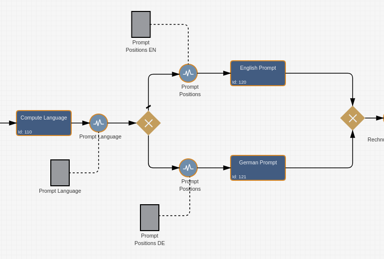

# Imixs-AI-Workflow

The Imixs-AI-Workflow module provides Adapter classes, CDI Beans and Service EJBs to integrate the Imixs-AI framework into the workflow processing life cycle.

 - **LLMAdapter**<br/>The Workflow Adapter class 'LLMAdapter' is used within the processing life cycle on a workflow instance to execute a LLM prompt. The adapter builds the prompt based on a given Prompt Template and evaluates the result object.  <br/>

 - **LLM-Definition** <br/>A data structure holding the information of a single LLM service endpoint  <br/>

 - **LLM-Service** <br/>A service EJB interacting with a Imixs-AI service endpoint  <br/>

 - **LLM-Controller** <br/> The CDI bean 'LLMController' is used for user interaction like data input, data verification and data confirmation.   <br/>

## The LLMAdapter

The adapter *'org.imixs.llm.workflow.LLMAdapter'* is used to send a prompt to the MML Service endpoint. The LLMAdaper automatically builds the prompt based on a prompt-template and stores the result into the corresponding workitem.  

### Configuration by Properties

The LLMAdapter can be configured by the following imixs.properties 

 - *llm.service.endpoint* - defines the serivce endpoint of tha Imixs-AI service

The parameters can be set in the imixs.properties or as environment variables:

	LLM_SERVICE_ENDPOINT=http://imixs-ai-llm:8000/

These parameters can be overwritten by the model. 

### Configuration by the Model

The main prompt configuration of the LLMAdapter is done through the model by defining a workflow result item named '*llm-config*'.



See the following example:
    
```xml
<llm-config name="PROMPT">
 <endpoint>http://imixs-ai.imixs.com:8000/</endpoint>

 <result-item>....</result-item>
 <result-event>....</result-event>
</llm-config>
```

Properties: 


| Property 	      | Type   | Description                               					     	   |
| --------------- | ------ | --------------------------------------------------------------------- |
| `endpoint`      |  URL   | Rest API endpoint for the llama-cpp server                            |
| `result-item`   | Text   | Item name to store the result returned by the LLM Server              |
| `result-event`  | Text   | Optional event identifier to process the result returned by the LLM Server  |


**Note:** The llm-config name `PROMPT` is mandatory. It defines the prompt definition and the service endpoint.


### The Prompt Definition

The prompt definition can be defined by a BPMN Data item containing the prompt template. The Prompt Template is defined by a XML document containing the model ID and teh prompt. See the following example:

```xml
<?xml version="1.0" encoding="UTF-8"?>
    <PromptData>
        <model_id>mistral-7b-instruct-v0.2.Q4_K_M.gguf</model_id>
        <prompt><![CDATA[<s>
    [INST] You are a clerk in a logistics company and you job is to check invoices documents. [/INST]		
            
   
    <filecontent>^.+\.([pP][dD][fF])$</filecontent>

    </s>
    [INST] Extract the language the invoice is written in and the company name.

    Output the information in a JSON object. 
    Create only the json object. Do not provide explanations or notes.

    Example JSON Object:

    { 
        "language": "German",
        "company.name": "Kraxi GmbH",
    }
    [/INST]

    ]]>
    </prompt>
</PromptData>  
```

**Note:** The prompt layout itself is defined by the Large Language Model and can diversify for each LLM.

## The Build-Events

Before a prompt is send to the llama-cpp service endpoint, the prompt-template is processed by Imixs-AI by so called PromptBuilder classes. These are CDI beans reacting on the `LLMPromptEvent` and are responsible to adapt the content of a prompt-template with content provided by the current workitem. There are some standard PromptBuilder classes that can be used out of the box:

### LLMIAdaptTextBuilder

The `LLMIAdaptTextBuilder` can be used to adapt all kind of text elements supported by the [Imixs-Workflow Adapt Text Feature](https://www.imixs.org/doc/engine/adapttext.html). For example you add item values to any part of the prompt-template

    <itemvalue>invoice.summary</itemvalue>

to place the 'invoice.summary' item into the template,


    <username>$editor</username>

to place the userid of the current editor into the template. 

Find more about Text adapters:

 - [Imixs-Workflow Adapt Text](https://www.imixs.org/doc/engine/adapttext.html)
 - [Imixs-Office-Workflow Text Adapter](https://doc.office-workflow.com/textadapter/index.html)


### LLMFileContextBuilder

The `LLMFileContextBuilder` is used to place the content of files attached to the current workitem into the prompt-template. The Builder  scans for all files matching a given filename or regular expression and adds the file content into the prompt-template. For example: 

    <FILECONTEXT>example.txt</FILECONTEXT>

will place the content of the attached file `example.txt' into the prompt-template, or

    <FILECONTEXT>^.+\.([pP][dD][fF])$</FILECONTEXT>

will place the content of all PDF files into the prompt-template. 

You can place the `<FILECONTEXT>` tag multiple times into one prompt-template.


## The Result-Events

To process the result returned by the LLM in an individual way you can specify a optional result-adapter-class. This class is expected as a CDI bean which is triggered by CDI events send from the LLMWorkflow Service during prompt processing

The Events are defined by the classes:

 - **LLMResultEvent** -  a CDI event fired by the LLMWorkflow. This even can be used in a observer pattern to provide alternative text processing after the LLM result is available.

 Depending on the event type a CDI bean can react on a LLMResultEvent or ignore it.

Example of a definition 

```xml
<llm-config name="PROMPT">
  <endpoint>http://imixs-ai.imixs.com:8000/</endpoint>
  <result-event>JSON</result-event>
</llm-config>
```

The configuration will trigger a LLMResultEvent with the event type 'JSON'. A CDI Bean can react on this event type:

```java
  ...
    public void onEvent(@Observes LLMResultEvent event) {
        if (event.getWorkitem() == null) {
            return;
        }
        if ("JSON".equals(event.getEventType())) {
            String jsonString = event.getPromptResult();
            .....
        }
    }
  ...
```


